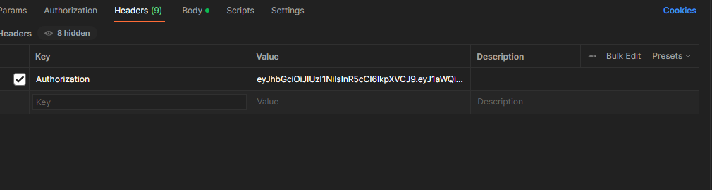

# Admision_System

Este programa es para gestionar los cursos , alumnos y profesores con los metodos siguientes:

Se puede registrar como alumno y profesor si no especifica el rol , se loguea automaticamente como alumno.

Este es el json que se debe adjuntar en postoman para el register:

REGISTER:
{
    "name": "",
    "surname": "",
    "username": "",
    "password": "",
    "email": "",
    "carnet": ""
}
(SE AGREGA EL CAMPO role, PARA INGRESAR COMO PROFESSOR_ROLE)

LOGIN:
{
    "username":"",
    "password": ""
}
(TAMBIEN SE PUEDE INGRESAR CON EL EMAIL)

UPDATE PROFESSOR
{
    "username": ""
}

SE PUEDE ACTUALIZAR EL CAMPO QUE SEA

UPDATE PASSWORD:
{
    "newPassword": ""
     CON LOS SIGUIENTES VALORES
    minLength: 8,
        minLowercase:1,
        minUppercase:1,
        minNumbers: 1,
        minSymbols: 0
}

FIND alumno
se agrega el id del alumno enla ruta
http://localhost:3000/admitionSystem/v1/studdent/findStuddent/:iud

UPDATE PROFESSOR
{
    "username": ""
}

SE PUEDE ACTUALIZAR EL CAMPO QUE SEA

UPDATE PASSWORD:
{
    "newPassword": ""
     CON LOS SIGUIENTES VALORES
    minLength: 8,
        minLowercase:1,
        minUppercase:1,
        minNumbers: 1,
        minSymbols: 0
}

UPDATE STUDDENT 
{
    "username": ""
}

SE PUEDE ACTUALIZAR EL CAMPO QUE SEA

CREAR CURSO:
Aqui hay un cambio en la configuracion de postman agregaremos un campo en header 

en header añadieremos 
Authorization :  <token>

el token que genere el inicio de sesion 
esto se realizara en las siguientes consultas en las consultas de course 

si no se coloca el token no se podra realizar la consulta

CREAR CURSO: 
{
    "name":"",
    "description": "",
    "professorId": ""
}

LISTAR CURSOS:
http://localhost:3000/admitionSystem/v1/course/:iud

TAMBIEN SE ADJUNTA EL TOKEN PARA PODER REALIZAR LA CONSULTA

UPDATE CURSO:
{
    "name":""
}
SE PUEDE ACTUALIZAR EL CAMPO QUE SEA
TAMBIEN SE ADJUNTA EL TOKEN PARA PODER REALIZAR LA CONSULTA

ASIGNARSE AL CURSO:
{
    "studentId": "",
    "courseId": ""
}

SE DEBE ADJUNTAR EL TOKEN PARA PODER REALIZAR LA CONSULTA

DE IGUAL MANERA LOS CONSULTAS DE TIPO GET, DELETE YA ESTAN ASIGNADAS LAS RUTAS EN LA COLECCION DE ENDPOINTS